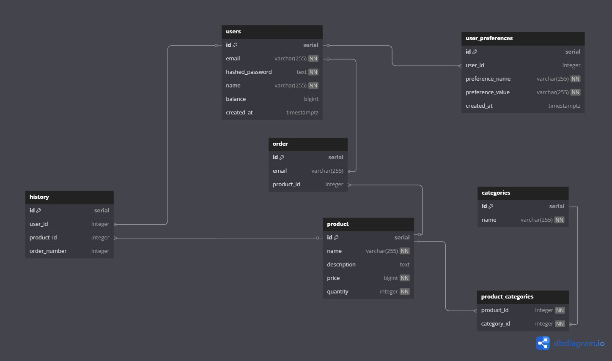

## Запуск проекта

1. Запусти Docker Compose:

   ```bash
   docker-compose up --build
   ```

2. После успешного запуска:

   - **Frontend**: [http://localhost:3000](http://localhost:3000)
   - **Auth Service API**: [http://localhost:8000/auth](http://localhost:8000/auth)
   - **PgAdmin**: [http://localhost:5050](http://localhost:5050)
   - **Product Catalog Service**: [http://localhost:8080](http://localhost:8080)

### Recommendation service
- Основные функции:
  - Персонализированные рекомендации товаров на основе:
    - Предпочтений пользователя (70% влияния)
    - Коллаборативной фильтрации (30% влияния)
    - Наличия товаров на складе

- Алгоритм рекомендаций:
  1. Анализ предпочтений пользователя:
     - Учет заполненной анкеты предпочтений по категориям
     - Расчет максимального балла соответствия товара предпочтениям

  2. Коллаборативная фильтрация:
     - Построение матрицы взаимодействий пользователь-товар
     - Поиск похожих пользователей через косинусное сходство
     - Анализ покупок похожих пользователей
     - Нормализация коллаборативных оценок

  3. Формирование итоговых рекомендаций:
     - Исключение ранее просмотренных товаров
     - Проверка наличия товара на складе
     - Расчет финального рейтинга как взвешенной суммы оценок
     - Сортировка по убыванию рейтинга

- Интеграция:
  - Работает с базой данных через SQLAlchemy
  - Использует sklearn для расчета косинусного сходства
  - Ведет подробное логирование всех этапов работы

### Frontend
- Доступны функции регистрации, входа и страница профиля пользователя.
- Навигация по разделам:
  - Профиль пользователя
  - Каталог товаров
  - Корзина покупок

### Auth Service API
- Основные эндпоинты:
  - POST `/auth/register` - регистрация
  - POST `/auth/login` - вход
  - GET `/auth/profile` - профиль пользователя
  - POST `/auth/change-password` - смена пароля
  - POST `/auth/add-balance` - пополнение баланса
  - POST `/auth/token/refresh` - обновление токена
  - GET `/auth/health` - проверка состояния сервиса
  - GET `/preferences/check` - проверка наличия заполненной анкеты предпочтений у пользователя
  - POST `/preferences/save` - сохранение заполненной анкеты предпочтений пользователя

### Product Catalog Service API
- Основные эндпоинты:
  - GET `/products/{email}` - получение списка всех товаров
  - POST `/products` - создание нового товара
  - DELETE `/products` - удаление товара
  - GET `/order/{email}` - получение корзины пользователя
  - POST `/order/add` - добавление товара в корзину
  - DELETE `/order/{email}/{product_id}` - удаление товара из корзины
  - POST `/order/{email}/pay` - оплата заказа
  - GET `/orders/{email}/history` - история заказов пользователя
  - POST `/order/{email}/clear` - очищение корзины

### Swagger документация
В проекте используется объединенная Swagger-документация для сервисов, написанных на FastAPI и Golang.
1. Запуск swagger UI:
   ```bash
   cd swagger
   python swagger.py
   ```
2. Просмотр Swagger:
   - Swagger UI: `https://petstore.swagger.io/?url=http://localhost:4040/combined-swagger.json`
3. Для остановки сервера нажмите Enter в консоли.

### Структура бд


## Разработка

### Frontend
- Исходный код фронтенда находится в `frontend/src/`
- Модули разделены по папкам в `src/modules/`
- Общие стили в `src/styles/common/`
- Сервисы для работы с API в `src/services/`
- Утилиты и вспомогательные функции в `src/utils/`

### Backend
- Сервис аутентификации в `backend/auth-service/`
- Модульная структура:
  - `app/` - основной код приложения
  - `models/` - модели данных
  - `services/` - бизнес-логика
  - `tests/` - тесты
- Сервис рекомендаций в `backend/recommendation-service/`
- Модульная структура:
  - `app/` - основной код приложения
  - `models/` - модели данных
- Сервис каталога товаров в `backend/product-catalog-service/`
- Модульная структура:
  - `src/application/` - обработчики HTTP запросов
  - `src/config/` - конфигурация приложения
  - `src/db/` - работа с базой данных
  - `src/models/` - модели данных
  - `src/docs/` - Swagger документация

## Тестирование

1. Запуск тестов:
   ```bash
   cd tests
   python run_tests.py
   ```
2. Просмотр отчетов:
   - Allure отчет: `allure-report/index.html`

3. Пример отчёта:


## Очистка Docker окружения

```bash
docker stop $(docker ps -a -q)
docker rm $(docker ps -a -q)
docker rmi $(docker images -q)
docker system prune -a --volumes -f
```
