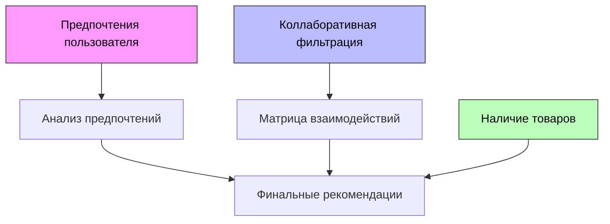

# Проект
Этот проект представляет собой распределенную систему с микросервисной архитектурой.

## Запуск проекта
Для запуска проекта необходимо выполнить следующие шаги:

### 1. Docker Compose
Запустите Docker Compose командой:
```bash
docker-compose up --build
```

### 2. Доступные сервисы
После успешного запуска будут доступны следующие сервисы:

#### Frontend
[http://localhost:3000](http://localhost:3000)

#### Auth Service API
[http://localhost:8000/auth](http://localhost:8000/auth)

#### PgAdmin
[http://localhost:5050](http://localhost:5050)

#### Product Catalog Service
[http://localhost:8080](http://localhost:8080)

#### Мониторинг
- Prometheus: [http://localhost:9090](http://localhost:9090)
- Grafana: [http://localhost:4000](http://localhost:4000)
  * Предустановленные дашборды:
    - Auth Service Dashboard
    - Product Catalog Service Dashboard

## Система рекомендаций
Сервис предоставляет персонализированные рекомендации товаров.

### Архитектура системы рекомендаций


### Алгоритм работы
#### 1. Анализ предпочтений пользователя
- Учет заполненной анкеты по категориям
- Расчет максимального балла соответствия товара
- Влияние на финальный результат: 70%

#### 2. Коллаборативная фильтрация
- Построение матрицы взаимодействий пользователь-товар
- Поиск похожих пользователей через косинусное сходство
- Анализ покупок похожих пользователей
- Нормализация коллаборативных оценок
- Влияние на финальный результат: 30%

### Формирование рекомендаций
- Исключение ранее просмотренных товаров
- Проверка наличия товара на складе
- Расчет финального рейтинга как взвешенной суммы оценок
- Сортировка по убыванию рейтинга

## Frontend
Основные компоненты фронтенд части:

### Функциональность
- Регистрация и вход в систему
- Личный кабинет пользователя
- Навигация по разделам:
  * Профиль пользователя
  * Каталог товаров
  * Корзина покупок

## Auth Service API
Основные эндпоинты:

### Аутентификация
- `POST /auth/register` - регистрация
- `POST /auth/login` - вход
- `GET /auth/profile` - профиль пользователя
- `POST /auth/change-password` - смена пароля
- `POST /auth/add-balance` - пополнение баланса
- `POST /auth/token/refresh` - обновление токена
- `GET /preferences/check` - проверка анкеты предпочтений
- `POST /preferences/save` - сохранение предпочтений

### Здоровье сервиса
- `GET /auth/health` - проверка состояния

## Product Catalog Service API
Основные эндпоинты:

### Товары
- `GET /products/{email}` - список товаров
- `POST /products` - создание товара
- `DELETE /products` - удаление товара

### Заказы
- `GET /order/{email}` - корзина пользователя
- `POST /order/add` - добавление в корзину
- `DELETE /order/{email}/{product_id}` - удаление из корзины
- `POST /order/{email}/pay` - оплата заказа
- `GET /orders/{email}/history` - история заказов
- `POST /order/{email}/clear` - очистка корзины

## Swagger документация
Для просмотра документации необходимо:
```bash
cd swagger
python swagger.py
```
Документация доступна по адресу:
[http://petstore.swagger.io/?url=http://localhost:4040/combined-swagger.json](http://petstore.swagger.io/?url=http://localhost:4040/combined-swagger.json)

## Структура базы данных


## Разработка
### Frontend
- Исходный код находится в `frontend/src/`
- Модули разделены по папкам в `src/modules/`
- Общие стили в `src/styles/common/`
- Сервисы для работы с API в `src/services/`
- Утилиты и вспомогательные функции в `src/utils/`

### Backend
#### Auth Service
- Расположен в `backend/auth-service/`
- Модульная структура:
  * `app/` - основной код приложения
  * `models/` - модели данных
  * `services/` - бизнес-логика
  * `tests/` - тесты

#### Recommendation Service
- Расположен в `backend/recommendation-service/`
- Модульная структура:
  * `app/` - основной код приложения
  * `models/` - модели данных

#### Product Catalog Service
- Расположен в `backend/product-catalog-service/`
- Модульная структура:
  * `src/application/` - обработчики HTTP запросов
  * `src/config/` - конфигурация приложения
  * `src/db/` - работа с базой данных
  * `src/models/` - модели данных
  * `src/docs/` - Swagger документация

## Тестирование
### Запуск тестов
```bash
cd tests
python run_tests.py
```

### Просмотр отчетов
Открыть файл `allure-report/index.html`


## Очистка Docker окружения
```bash
docker stop $(docker ps -a -q)
docker rm $(docker ps -a -q)
docker rmi $(docker images -q)
docker system prune -a --volumes -f
```
